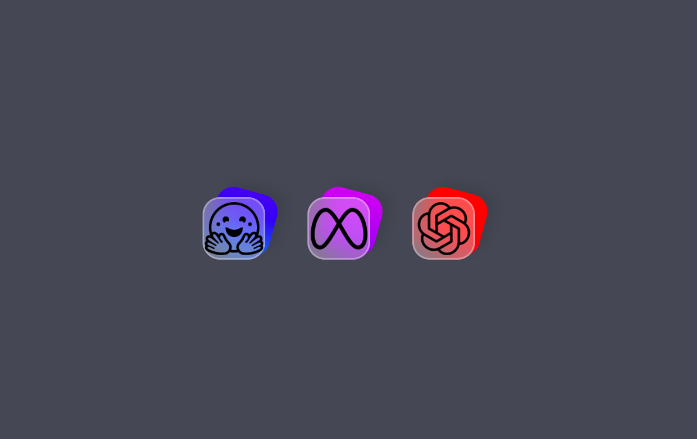
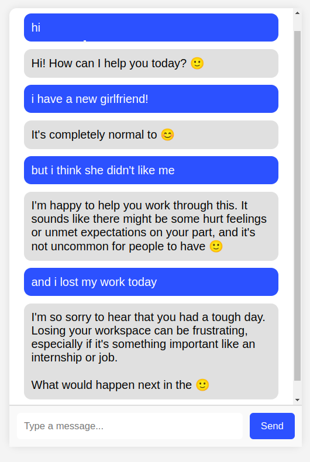

# AI Chatbots on Django

## Installation and launch

1. Clone repositories:

   With HTTP
   ```bash
   git clone https://github.com/k0drin/AI-Chatbots-on-Django.git
   ```

   With SSH
   ```bash
   git clone git@github.com:k0drin/AI-Chatbots-on-Django.git
   ```
2. Install the virtual environment and activate it:
   ```bash
    python3 -m venv venv
    source venv/bin/activate  # For Windows, use `venv\Scripts\activate`
    ```
3. Install all dependencies:
   ```bash
    pip install -r requirements.txt
    ```
4. Fill you .env file:
   ```bash
   SECRET_KEY=...
   OPENAI_API_KEY...
   ```
4. Perform migrations:
   ```bash
    python manage.py migrate
    ```

5. Start the development server:
   ```bash
    python manage.py runserver
    ```

6 . Now just open it in your browser this address `http://127.0.0.1:8000/` and make your choice

<div style="text-align: center;">
    
    
</div>
